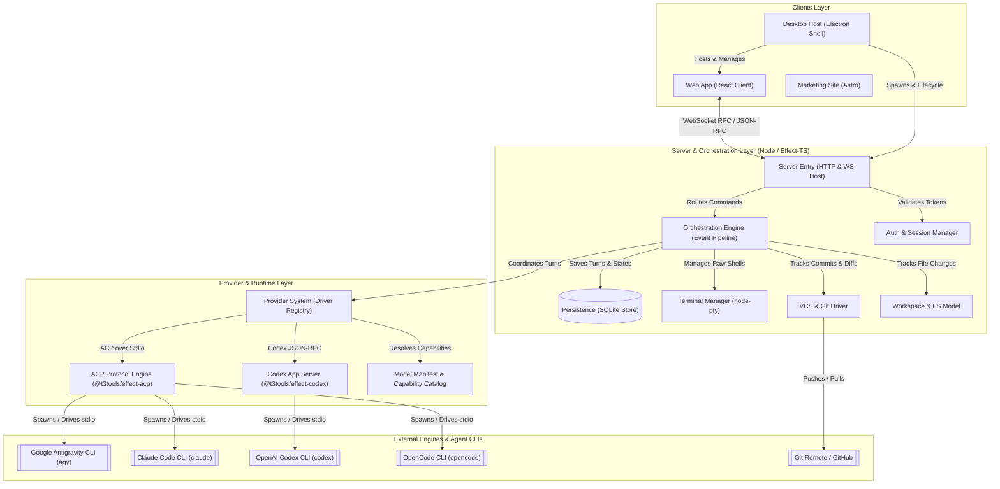
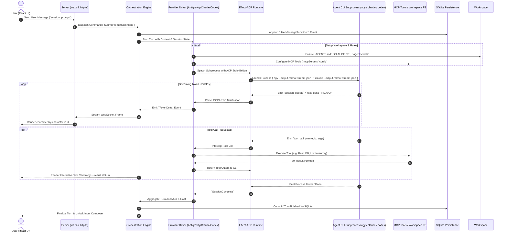

# T3Code Architecture & Execution Flow
> **How T3Code turns terminal-based AI Agent CLIs into a rich, reactive desktop and web application.**

---

## 1. High-Level System Architecture

T3Code bridges **Local Agent CLIs** (Google Antigravity, Claude Code, OpenAI Codex, OpenCode) with a modern **React Web Client** and **Electron Desktop Shell** through an **Event-Sourced Orchestration Pipeline** and the **Agent Client Protocol (ACP)**.

---

## 2. End-to-End Execution Pipeline (How a Message Becomes a Stream)

When a user types a prompt in T3Code's UI, here is the lifecycle from keystroke to streaming tokens and tool runs:

---

## 3. Core Architectural Pillars of T3Code

### 🏛️ Pillar 1: Agent Client Protocol (ACP) over Stdio
Instead of treating CLIs as blunt command-line strings or scraping raw ANSI terminal escape sequences, T3Code standardizes interaction through **Agent Client Protocol (ACP)** (`packages/effect-acp`):
- **Structured JSON-RPC 2.0**: Every CLI input and output is encoded as structured JSON frames via stdin/stdout.
- **Bi-directional Permission Handshake**: When an agent requests a file edit or bash execution, ACP negotiates permissions with the user interface (`bypassPermissions` or interactive approval cards).
- **Session Continuity**: Retains conversation history and session IDs across multiple turns without needing cold boots.

### 🧩 Pillar 2: Dynamic Model Manifest & Brand Identity
- **Central Catalog (`model-manifest.json`)**: Declares all available models, providers, context limits, reasoning effort tiers, latency ratings, and token pricing in a single schema.
- **Separation of Host CLI vs Model Brand**:
  - The CLI executable is just the transport (`agy`, `claude`, `codex`).
  - The model (e.g. `Gemini 3.8 Flash`, `Claude Sonnet 4.6`, `GPT-5.6 Terra`) carries its own brand logo, reasoning controls, and pricing badges.

### 📁 Pillar 3: Workspace Rules & Dynamic Skill Dispatch
Before spawning an agent CLI, T3Code prepares the workspace with rich context:
- Writes `.agents/rules/`, `AGENTS.md`, and `CLAUDE.md` containing runtime guidelines and instructions.
- Auto-discovers installed skills (`.agents/skills/<skill>/SKILL.md`) and registers them with the agent.
- Configures MCP tool definitions (`.mcp.json` / `mcp_config.json`) so the CLI assistant has access to domain-specific database tools.

### ⏱️ Pillar 4: Git-Based Checkpointing & Snapshot Rollbacks
- T3Code integrates a lightweight Git VCS driver that records a commit or snapshot before and after agent modifications.
- Allows the user to inspect side-by-side visual diffs and roll back undesired changes with a single click.

### 🖥️ Pillar 5: Electron Desktop Shell + Remote Access
- The desktop application (`apps/desktop`) bundles the Fastify server and Electron webview into an integrated desktop binary.
- Supports **SSH** and **Tailscale** connectivity (`packages/ssh`, `packages/tailscale`), enabling users to connect their local desktop UI to agent instances running on remote servers or cloud VMs.

---

## 4. Comparison: T3Code vs BusinessKit Agent Architecture

| Feature | T3Code Architecture | BusinessKit Native Architecture |
|---|---|---|
| **Client Framework** | React (SPA) + Electron Shell | Qwik City + Tauri v2 (Rust Native) |
| **Server Engine** | Node.js Fastify + Effect-TS | Tauri Rust Subprocess Engine (`cli.rs`) |
| **Persistence** | SQLite Store (Node `better-sqlite3`) | UserDB (Turso / LibSQL SQLite in Rust) |
| **CLI Protocol** | Agent Client Protocol (ACP) stdio JSON-RPC | Stream-JSON NDJSON Event Parser |
| **Zero Cloud Fees** | ✅ Yes (runs user's local CLIs) | ✅ Yes (runs user's local CLIs) |
| **Business DB Tools** | General Coding / Shell / VCS tools | 10 BusinessKit MCP Tools (Billing, ERP, CRM) |
| **Memory / Footprint** | Higher (Node.js + Electron runtime) | Ultra-lightweight (Rust Tauri native webview) |

---

## 5. Summary
T3Code achieves its desktop-grade agent experience by:
1. Treating agent CLIs as **structured RPC daemons** rather than plain terminals.
2. Streaming tokens character-by-character through **real-time JSON-RPC pipelines**.
3. Decoupling the **CLI host runtime** from the **underlying model's visual branding and reasoning effort**.
4. Providing **built-in visual diffs, workspace rules, and MCP toolbelt integration**.
