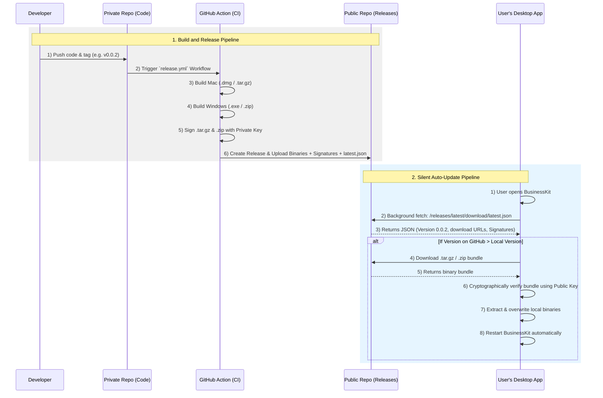

# BusinessKit Auto-Updater Flow

This document outlines the architecture and sequence for compiling, distributing, and silently installing updates to the BusinessKit Tauri Desktop App using GitHub Actions and GitHub Releases.

## Architecture

BusinessKit uses a two-repository architecture to securely distribute updates without exposing the proprietary source code:

1. **`businesskit-app` (Private):** Contains all source code, API keys, and the GitHub Action workflow.
2. **`businesskit` (Public):** An empty repository used strictly as a free, globally distributed CDN for hosting the compiled release binaries (`.dmg`, `.exe`, `.tar.gz`, `.zip`) and the updater manifest (`latest.json`).

## Workflow Diagram



## Setup & Keys

The updater relies on cryptographic signatures to prevent man-in-the-middle (MITM) attacks.

- **Public Key:** Hardcoded into `src-tauri/tauri.conf.json`. The app uses this to verify that the downloaded update genuinely came from the developer.
- **Private Key:** Stored securely in GitHub Secrets (`TAURI_PRIVATE_KEY`). The GitHub Action uses this to sign the compiled update bundles before uploading them to the public repository.
- **GitHub Token:** A Personal Access Token stored in GitHub Secrets (`GH_RELEASE_TOKEN`). The GitHub Action uses this to authenticate and push the release files from the private repository to the public repository.

## The Updater JSON (`latest.json`)

The public repository hosts a dynamically generated `latest.json` file. The Tauri app periodically polls this file to check for updates. The file structure looks like this:

```json
{
  "version": "0.0.2",
  "notes": "See the assets to download this version and install.",
  "pub_date": "2026-07-23T10:00:00Z",
  "platforms": {
    "darwin-aarch64": {
      "signature": "dW50...",
      "url": "https://github.com/businesskitai/businesskit/releases/download/v0.0.2/BusinessKit_0.0.2_aarch64.app.tar.gz"
    },
    "windows-x86_64": {
      "signature": "dW50...",
      "url": "https://github.com/businesskitai/businesskit/releases/download/v0.0.2/BusinessKit_0.0.2_x64.zip"
    }
  }
}
```
