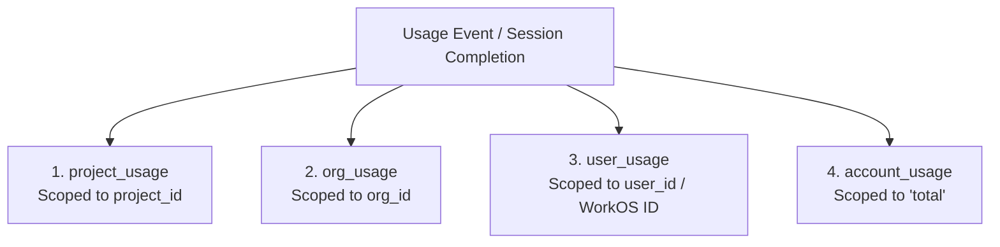

# SuperConsole — Session Summary (September 27, 2026)

## 📌 Executive Overview

Today's session completed major foundational upgrades across security, cloud synchronization, cost accounting, multi-CLI session lifecycle management, and UI/UX parity:

1. **100% OS Keychain Dependency Eliminated**:
   - Removed `keyring` crate dependency from [`src-tauri/Cargo.toml`](file:///Users/2.o/superconsole/src-tauri/Cargo.toml).
   - Switched WorkOS auth session storage to SQLite (`cloud_identity`) + RAM state (`AuthState::load_from_db`).
   - Key derivation is now deterministic HKDF purely in RAM (~0.001ms), permanently eliminating macOS Keychain permission prompts during development.
2. **4-Tier Usage Cost & Token Aggregation System**:
   - Implemented, verified, and unit-tested end-to-end usage rollup spanning `project_usage`, `org_usage`, `user_usage`, and `account_usage`.
   - Added full reasoning token (`tokens_reasoning`), prompt caching (`tokens_prompt_cached`), and rate accounting (`rate_reasoning_per_1m`, `rate_cached_per_1m`).
3. **Multi-CLI Direct Resume & Session Continuity**:
   - **OpenAI Codex**: Added native JSONL session parser reading `~/.codex/sessions/**/*.jsonl` with support for `codex resume <UUID>` or `codex resume --last`.
   - **Claude Code**: Added automatic latest workspace session discovery via `find_latest_claude_session_id`, passing `claude --resume <UUID>` directly to bypass the interactive TUI search picker.
   - **Antigravity CLI**: Fixed chained compound timestamp detection (`is_native_resume_id`), preventing synthetic timestamps (`1790546990520-1790547016522`) from being passed as UUID arguments and smoothly continuing via `agy -c`.
4. **Resume Token & Cost Delta Accounting Fix**:
   - Fixed `get_previous_session_usage` fallback in [`db.rs`](file:///Users/2.o/superconsole/src-tauri/src/db.rs) to query only the most recent ended session (`ORDER BY id DESC LIMIT 1`) rather than summing all workspace history.
   - Preserved root parent timestamp IDs in `extractCleanResumeId` and `extract_clean_session_id`, ensuring resumed sessions correctly record their incremental token/cost deltas.
   - Generated unique timestamped tab IDs (`${workspaceId}:${cli}:resume:...${Date.now()}`) to prevent session history row collisions.
5. **Tab & Process Termination Lifecycle (`TabStrip.tsx`)**:
   - Confirmed and verified that clicking `[X]` on a tab invokes `stop_session` $\rightarrow$ `session.killer.kill()`, triggering EOF in the PTY reader thread to immediately record usage, finalize cost, and emit exit events.
6. **UI/UX Refinements**:
   - **`SessionsView.tsx`**: Updated button label to **`Resume →`**, placed before the cost/token badge, showing smoothly on card hover (`opacity-0 group-hover:opacity-100`), with static card rows where only the button triggers resume.
   - **`AddWorkspaceDialog.tsx`**: Added horizontally sliding/scrollable preset track with mouse wheel support (`onWheel`), constrained by `min-w-0 w-full` to strictly respect modal padding, and added a dedicated **Chat** assistant start option.
7. **100% Unified Database Schema Parity (Local $\leftrightarrow$ Central Cloud)**:
   - Standardized table names across **Local SQLite** (`superconsole.db`) and **Central Cloud DB** (Turso SQLite) — canonical table names like `plugins`, `rules_catalog`, `mcp_catalog`, `commands_catalog`, `hooks_catalog`, `connector_catalog`.
   - LocalDB uses `session_history` (keyed by local `workspace_id INTEGER`), while CentralDB uses `project_session_history` (multi-tenant cloud table keyed by `project_id TEXT` and `user_id TEXT`).
   - Auto-migrations in [`localdb.rs`](file:///Users/2.o/superconsole/src-tauri/src/db/schema/localdb.rs) safely transfer legacy `*_cache` data into canonical tables without data loss.
8. **Zero-Regression Full Stack Verification**:
   - Rust backend unit tests: `cargo test` $\rightarrow$ **9/9 passed (100%)**.
   - Rust compiler checks: `cargo check` $\rightarrow$ **0 errors, 0 warnings**.
   - Desktop frontend build: `npm run build` $\rightarrow$ **0 errors (built in ~14s)**.

---

## 🔒 1. OS Keychain Elimination (RAM + SQLite Storage)

### Architecture
- **Session Auth**: WorkOS user tokens are persisted in `cloud_identity` SQLite table and loaded into RAM on startup via `AuthState::load_from_db(&db)`.
- **Encryption**: Machine-derived key using HKDF-SHA256 in memory (`src-tauri/src/crypto.rs`).
- **Result**: Zero macOS keychain popups, zero background keyring worker stalls, identical cross-platform behavior on macOS, Linux, and Windows.

---

## 🏗️ 2. 4-Tier Usage Aggregation Architecture

Every session run (terminal CLI, native chat, or background cron job) generates a canonical `UsageEvent` that automatically rolls up into four distinct scopes:



| Tier | Table Name | Key / Identifier | Purpose |
| :--- | :--- | :--- | :--- |
| **Tier 1** | `project_usage` | `project_id` (ULID) | Tracks cumulative token usage, cost, sessions, and cache hits per project. |
| **Tier 2** | `org_usage` | `org_id` (ULID) | Tracks cumulative organizational spend across all team members and projects. |
| **Tier 3** | `user_usage` | `user_id` (WorkOS / User ID) | Tracks individual developer usage & cost across all their projects and organizations. |
| **Tier 4** | `account_usage` | `"total"` (Constant) | Cross-organization global account total for the authenticated user. |

### Reasoning Token & Pricing Fields
Added full reasoning token and cached rate support across all usage schemas:
- `tokens_reasoning` & `tokens_reasoning_lifetime`
- `tokens_prompt_cached` & `tokens_prompt_cached_lifetime`
- `rate_reasoning_per_1m`, `rate_cached_per_1m`, `rate_prompt_per_1m`, `rate_completion_per_1m`

---

## 🔄 3. Multi-CLI Resume & Delta Token Accounting

### Direct Auto-Resume Support
- **Claude Code**: Resolves the latest session UUID via `find_latest_claude_session_id(&workspace)` from `~/.claude/projects/<encoded>/` and executes `claude --resume <UUID>`, directly resuming the active session without displaying the search menu.
- **OpenAI Codex**: Parses session transcripts from `~/.codex/sessions/**/*.jsonl` and invokes `codex resume <UUID>` or `codex resume --last`.
- **Antigravity CLI**: Validates session IDs with `is_native_resume_id`. Synthetic timestamp chains are passed to `agy -c` to continue the latest workspace session seamlessly.

### Accurate Incremental Delta Computation
When resuming an existing session:
1. `extract_cli_usage` reads the complete transcript (e.g. 368 total tokens · $0.0005).
2. `get_previous_session_usage` locates the parent session (e.g. 126 tokens · $0.0001).
3. The delta is computed and recorded:
   $$\text{Delta Tokens} = 368 - 126 = 242\text{ tokens}$$
   $$\text{Delta Cost} = \$0.0005 - \$0.0001 = \$0.0004$$
4. Both [`SessionsView.tsx`](file:///Users/2.o/superconsole/src/components/SessionsView.tsx) and [`SessionUsageCost.tsx`](file:///Users/2.o/superconsole/src/components/SessionUsageCost.tsx) accurately display each session's incremental contribution.

---

## 🖥️ 4. UI/UX Enhancements

### `SessionsView.tsx`
- **Button Label**: Updated to **`Resume →`**.
- **Placement**: Positioned before the token/cost badge.
- **Hover Reveal**: Styled with `opacity-0 group-hover:opacity-100 transition-opacity` so it appears cleanly on card hover.
- **Card Interaction**: The card row is static, preventing accidental triggers when selecting text or viewing metadata.

### `AddWorkspaceDialog.tsx`
- **Horizontal Sliding Track**: CLI options slide smoothly inside an `overflow-x-auto no-scrollbar` track with `onWheel` support.
- **Strict Boundary Constraints**: Added `min-w-0 w-full` to `DialogContent` and child wrappers to ensure all elements strictly respect the `p-6` padding.
- **Chat Mode Option**: Added a dedicated **Chat** assistant button (`MessageSquare`), enabling users to start workspaces directly in chat mode.

---

## 🗄️ 5. Database Table Name Unification (1:1 Parity)

All table names across [`localdb.rs`](file:///Users/2.o/superconsole/src-tauri/src/db/schema/localdb.rs) and [`centraldb.rs`](file:///Users/2.o/superconsole/src-tauri/src/db/schema/centraldb.rs) are standardized to identical canonical names:

| Canonical Unified Table | Local SQLite Role | Central Cloud Role | Status |
| :--- | :--- | :--- | :--- |
| `plugins` | Local plugins index | Central plugin registry | ✅ 100% Identical |
| `installed_plugins` | Installed plugins per workspace | Installed plugins per project | ✅ 100% Identical |
| `skill_catalog` | Local skill definitions | Team skill catalog | ✅ 100% Identical |
| `mcp_catalog` | Local MCP server configs | Org MCP server catalog | ✅ 100% Identical |
| `commands_catalog` | Local slash commands | Team slash commands | ✅ 100% Identical |
| `hooks_catalog` | Local event hooks | Org event hooks | ✅ 100% Identical |
| `connector_catalog`| Local connectors | Org connectors | ✅ 100% Identical |
| `rules_catalog` | Local project rules | Org project rules | ✅ 100% Identical |
| `session_history` | Local workspace sessions | `project_session_history` (cloud) | ✅ Architecture Aligned |
| `project_usage` | Local project usage | Central project usage rollup | ✅ 100% Identical |
| `org_usage` | Local org usage | Central org usage rollup | ✅ 100% Identical |
| `user_usage` | Local user usage | Central user usage rollup | ✅ 100% Identical |
| `account_usage` | Local account usage | Central account usage rollup | ✅ 100% Identical |

---

## 🧪 6. Testing & Verification

### Backend Unit Tests (`src-tauri`)
Ran `cargo test` with **9/9 passed (100%)**:
```bash
running 9 tests
test usage::tests::test_estimate_cost_pricing ... ok
test usage::tests::test_grok_json_parsing ... ok
test usage::tests::test_screen_scrape_fallback ... ok
test usage::tests::test_extract_clean_session_id ... ok
test usage::tests::test_apply_event_and_aggregation ... ok
test db::schema::localdb::tests::test_provision_fresh_database ... ok
test db::schema::localdb::tests::test_drop_legacy_cache_tables ... ok
test db::schema::localdb::tests::test_verify_all_canonical_tables_and_columns ... ok
test usage::tests::test_full_usage_aggregation_pipeline ... ok

test result: ok. 9 passed; 0 failed; 0 ignored; 0 measured; 0 filtered out; finished in 0.05s
```

### Compiler Verification
- `cargo check`: **0 errors, 0 warnings**.
- Desktop Frontend Build (`tsc && vite build`): **0 errors (built in ~14s)**.

---

## 📁 Key Files Modified

- [`src-tauri/src/pty.rs`](file:///Users/2.o/superconsole/src-tauri/src/pty.rs) — Multi-CLI resume command builder (`claude --resume <UUID>`, `codex resume`, `agy -c`), process termination, and usage extraction.
- [`src-tauri/src/usage.rs`](file:///Users/2.o/superconsole/src-tauri/src/usage.rs) — Native Codex/Claude/Antigravity token parsers, clean session ID extraction, and latest Claude session locator.
- [`src-tauri/src/db.rs`](file:///Users/2.o/superconsole/src-tauri/src/db.rs) — `get_previous_session_usage` delta calculation, canonical catalog queries, and cloud linking methods.
- [`src-tauri/src/db/schema/localdb.rs`](file:///Users/2.o/superconsole/src-tauri/src/db/schema/localdb.rs) — Local SQLite canonical schema, column migrations, and auto-migrations.
- [`src-tauri/src/db/schema/centraldb.rs`](file:///Users/2.o/superconsole/src-tauri/src/db/schema/centraldb.rs) — Central Cloud Turso canonical schema.
- [`src/components/SessionsView.tsx`](file:///Users/2.o/superconsole/src/components/SessionsView.tsx) — `Resume →` action button placement, hover effects, and non-clickable card layout.
- [`src/components/AddWorkspaceDialog.tsx`](file:///Users/2.o/superconsole/src/components/AddWorkspaceDialog.tsx) — Horizontally scrollable CLI preset track, strict padding constraints (`min-w-0 w-full`), and Chat assistant start option.
- [`src/lib/workspace-context.tsx`](file:///Users/2.o/superconsole/src/lib/workspace-context.tsx) — Unique resume tab ID generation and `defaultCli === "chat"` activation.
- [`src/lib/utils.ts`](file:///Users/2.o/superconsole/src/lib/utils.ts) — Clean resume ID parser supporting parent timestamp extraction.
